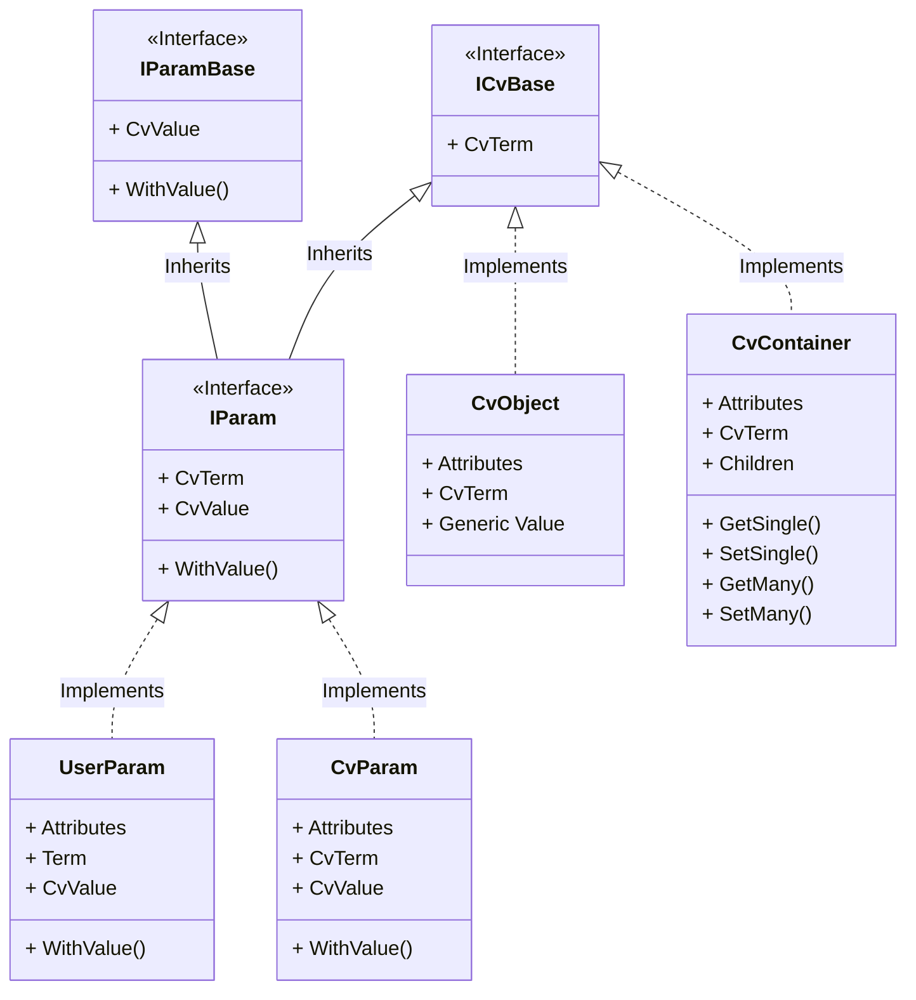

# ArcGraphModel

## Library structure
### CvTokens

## develop

### prerequisites

- .NET 6 SDK
- nodejs (tested with ~v16)

### setup

- dotnet tool restore
- npm install

### build

#### Linux/macos

- make `build.sh` executable
- run `build.sh`

#### Windows

run `build.cmd`

#### or run the build project directly:

`dotnet run --project ./build/build.fsproj`

### test

#### Linux/macos

- run `build.sh runTests`

#### Windows

- run `build.cmd runTests`

#### or run the build project directly:

`dotnet run --project ./build/build.fsproj runTests`
