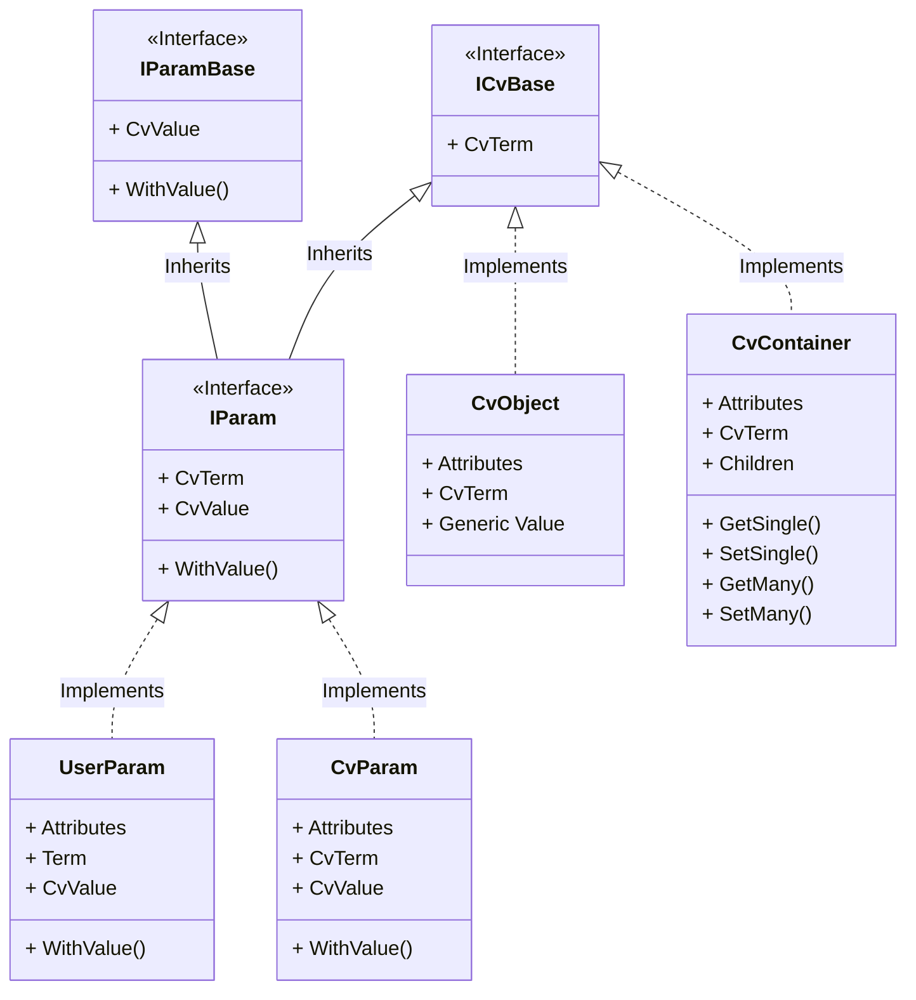

# ArcGraphModel

## Library structure
### CvTokens

## Develop

### Prerequisites

- .NET 6 SDK
- nodejs (tested with ~v16)

### Setup

- dotnet tool restore
- npm install

### Build whole project

#### Linux/macOS

- make `build.sh` executable
- run `build.sh`

#### Windows

run `build.cmd`

#### or run the build project directly:

`dotnet run --project ./build/build.fsproj`

### Build ontologies (YAML to OBO)

#### Linux/macOS

- make `build.sh` executable
- run `build.sh buildOntologies`

#### Windows

run `build.cmd buildOntologies`

#### or run the build project directly:

`dotnet run --project ./build/build.fsproj buildOntologies`

### Test

#### Linux/macOS

- run `build.sh runTests`

#### Windows

- run `build.cmd runTests`

#### or run the build project directly:

`dotnet run --project ./build/build.fsproj runTests`
